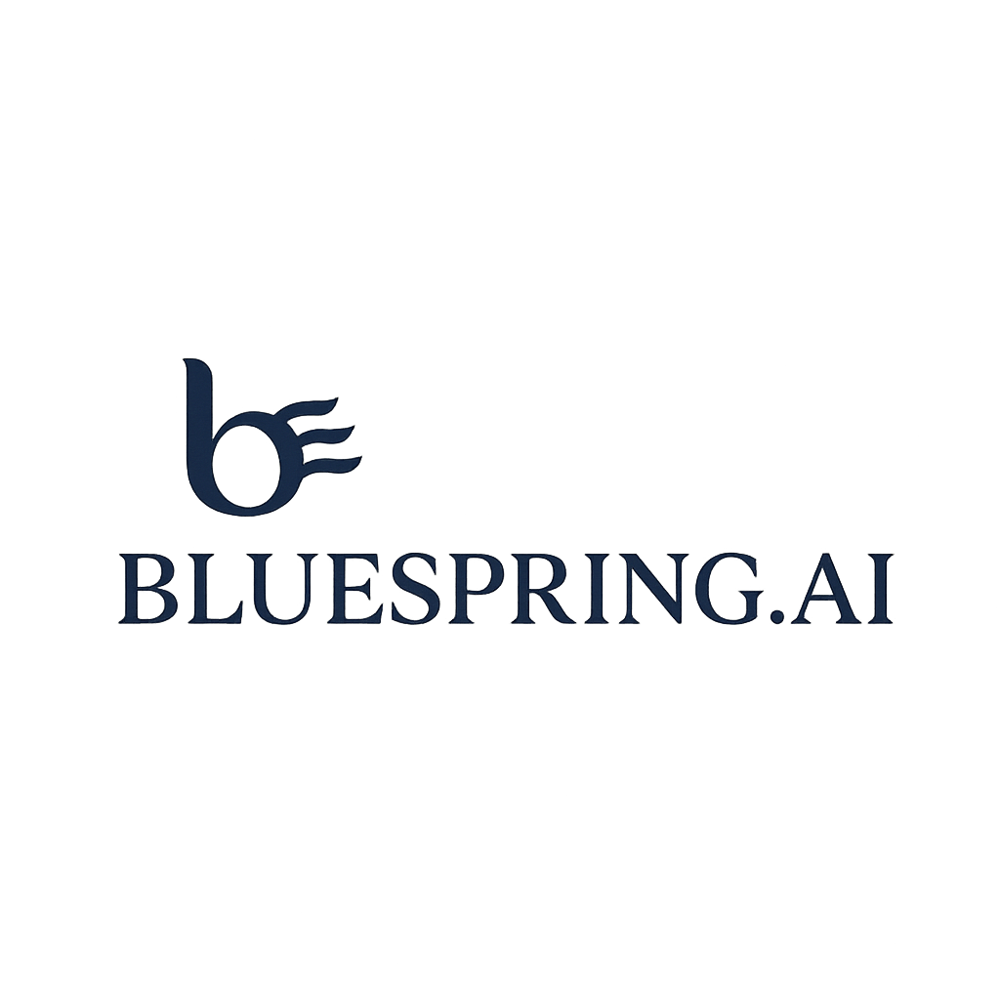

# 🎓 Final Year Capstone Project: AI Full-Stack Chatbot Development

<div align="center">



**Bluesprings AI**  
*Empowering the Future of AI Development*

---

</div>

**Company:** Bluesprings AI  
**Academic Year:** 2024-2025  
**Eligible Branches:** Computer Science (CS), Electronics & Communication Engineering (ECE), Information Technology (IT), Artificial Intelligence (AI)  
**Project Type:** Industry-Ready Full-Stack Application Development  
**Duration:** **3 days + 2 days grace period**  
**Total Marks:** 100  

---

## 🎯 Project Overview

Welcome to your final year capstone project! This is not just another academic assignment - it's your opportunity to build a **production-ready, enterprise-grade AI chatbot** that demonstrates your full-stack development capabilities. You will be creating a ChatGPT-style application that showcases modern software engineering practices, AI integration, and scalable architecture.

### 🚀 What You'll Build

A sophisticated, multi-provider AI chatbot application with:
- **Real-time streaming responses** (like ChatGPT's live typing effect)
- **Multi-AI provider support** (OpenAI, Anthropic, Google Gemini)
- **Professional-grade user interface** with session management
- **Database persistence** and user authentication
- **Production-ready deployment** capabilities

---

## 🏗️ Technical Architecture Requirements

### Frontend Technology Stack
- **Framework:** React.js (JavaScript only - no TypeScript allowed)
- **State Management:** Redux OR Thesys.dev (choose one)
- **Styling:** CSS3 with modern design principles
- **UI Components:** Custom-built components (no UI libraries like Material-UI, Ant Design)
- **Responsiveness:** Mobile-first design approach

### Backend Technology Stack
- **Option 1:** FastAPI (Python 3.8+) with async/await support
- **Option 2:** Express.js (Node.js 16+) with ES6+ features
- **API Design:** RESTful API with proper HTTP status codes
- **Authentication:** JWT-based session management
- **Validation:** Request/response validation with proper error handling

### Database Requirements
- **Primary Database:** PostgreSQL OR MongoDB OR MySQL
- **Connection Pooling:** Implement connection pooling for scalability
- **Data Models:** Proper normalization and relationship design
- **Migrations:** Database schema versioning and migration scripts

### Streaming Technology
- **Protocol:** Server-Sent Events (SSE) with `text/event-stream` MIME type
- **Implementation:** Real-time token-by-token streaming (not batch responses)
- **Error Handling:** Graceful fallback for connection failures
- **Performance:** Optimized for low-latency response delivery

---

## 🔧 Core Features (Mandatory Implementation)

### 1. User Interface Components

#### Sidebar Navigation:
- User profile section
- Session list with timestamps
- New session creation button
- Session search and filtering

#### Main Chat Area:
- Message thread display with role indicators (User/AI)
- Real-time typing indicators
- Message timestamps and metadata
- Responsive design for all screen sizes

#### Input Section:
- Multi-line text input with character count
- Send button with loading states
- Stop generation button (for streaming responses)
- File attachment support (bonus feature)

### 2. AI Provider Integration

#### OpenAI Integration:
- GPT-3.5-turbo and GPT-4 model support
- Proper API key management
- Rate limiting and error handling

#### Anthropic Claude Integration:
- Claude-3-Haiku and Claude-3-Sonnet support
- Message formatting and context management

#### Google Gemini Integration:
- Gemini Pro and Gemini Flash support
- Multi-modal input handling (text + images)

#### Provider Switching:
- Real-time model switching without page reload
- Model comparison and selection interface
- Provider-specific configuration options

### 3. Session Management

#### User Sessions:
- Unique session identification
- Session titles and descriptions
- Message history persistence
- Session export functionality

#### Data Persistence:
- Real-time database updates
- Message threading and conversation flow
- User preferences and settings storage

### 4. Streaming Implementation

#### Server-Sent Events:
- Token-by-token response streaming
- Proper event formatting (`data: {"delta": "..."}`)
- Connection management and reconnection logic
- Streaming state management (start, progress, complete)

#### User Experience:
- Live typing animation
- Progress indicators
- Stop generation capability
- Error recovery mechanisms

---

## 📊 Database Schema Requirements

### Core Tables/Collections
```sql
-- Users Table
users (
  id: UUID (Primary Key)
  username: VARCHAR(50) UNIQUE
  email: VARCHAR(100) UNIQUE
  created_at: TIMESTAMP
  last_login: TIMESTAMP
)

-- Sessions Table
sessions (
  id: UUID (Primary Key)
  user_id: UUID (Foreign Key)
  title: VARCHAR(200)
  created_at: TIMESTAMP
  updated_at: TIMESTAMP
  provider: VARCHAR(50)
  model: VARCHAR(100)
)

-- Messages Table
messages (
  id: UUID (Primary Key)
  session_id: UUID (Foreign Key)
  role: ENUM('user', 'assistant', 'system')
  content: TEXT
  provider: VARCHAR(50)
  model: VARCHAR(100)
  tokens_used: INTEGER
  created_at: TIMESTAMP
  metadata: JSONB
)
```

---

## 🎬 Deliverables (Strict Requirements)

### 1. GitHub Repository (30 marks)

#### Repository Structure:
- Clean, organized folder structure
- Proper `.gitignore` files
- Comprehensive `README.md` with setup instructions
- `ARCHITECTURE.md` with system design diagrams
- `API_DOCUMENTATION.md` with endpoint specifications
- `DEPLOYMENT.md` with deployment instructions

#### README.md Must Include:
- Project title and description
- Technology stack details
- Installation and setup instructions
- Environment variables configuration (`.env.example`)
- API testing examples (including SSE curl commands)
- Screenshots of the application
- Team member information and contributions

#### ARCHITECTURE.md Must Include:
- System architecture diagram (use draw.io, Lucidchart, or similar)
- Database ER diagram
- API flow diagrams
- Component interaction diagrams
- Deployment architecture (if applicable)

### 2. Demo Video (40 marks)
- **Duration:** **Maximum 2 minutes** (strictly enforced)
- **Format:** MP4 or WebM with clear audio
- **Face Recording:** Your face must be visible throughout the video
- **Upload Requirements:** 
  - **Video must be uploaded to your Google Drive/OneDrive**
  - **Share the drive link in your submission**
  - **Ensure the link is accessible to evaluators**
- **Content Requirements:**
  - Introduction and project overview (15 seconds)
  - Live demonstration of all core features
  - Multi-provider switching demonstration
  - Session management and persistence
  - Database evidence (show actual data in tables)
  - Error handling demonstration
  - Performance and responsiveness showcase

- **Video Quality Standards:**
  - 1080p resolution minimum
  - Clear audio narration
  - Professional presentation style
  - Smooth screen transitions
  - No technical glitches or errors

**⚠️ IMPORTANT: BE PREPARED TO MAKE CHANGES TO THE CODE IN LIVE AND THEN DEMO.**

### 3. Database Evidence (15 marks)
- **Screenshots Required:**
  - Database schema/structure
  - Sample data in tables
  - Query results showing message persistence
  - User session data
  - Provider and model information

### 4. Code Quality and Documentation (15 marks)
- **Code Standards:**
  - Consistent coding style and formatting
  - Proper error handling and validation
  - Comprehensive inline comments
  - Meaningful variable and function names
  - Modular and reusable code structure

- **Documentation Quality:**
  - Clear API documentation
  - Setup and installation guides
  - Troubleshooting guides
  - Code comments and explanations

---

## 🏆 Bonus Opportunities

### Bonus 1: Ollama Local Provider (+1000 marks)

#### Implementation Requirements:
- Local Ollama server setup
- Model downloading and management
- Integration with existing provider system
- Performance optimization for local inference
- UI toggle for local vs. cloud providers

### Bonus 2: AWS Cloud Deployment (+3000 marks)

#### Deployment Requirements:
- EC2 instance setup and configuration
- S3 bucket for static frontend hosting
- Domain configuration and SSL certificates
- Load balancer and auto-scaling setup
- Monitoring and logging implementation

#### Additional Video:
- 2-3 minute deployment demonstration

---

## ⚠️ Important Guidelines and Restrictions

### Submission Requirements
- **Team Formation:** Students must form teams of size **2** and submit only **one submission per team**
- **Google Form Submission:** **[SUBMIT HERE: https://forms.gle/sCHmPZLzF3WR3PKj8](https://forms.gle/sCHmPZLzF3WR3PKj8)**
- **Deadline:** Strict adherence to submission deadlines
- **Format:** All deliverables must be in specified formats
- **Quality:** Professional-grade work expected
- **Testing:** Thorough testing of all features before submission

**⚠️ CRITICAL SUBMISSION REQUIREMENT: SUBMIT ALL THE CHATS BY EXPORTING CHATS THAT YOU HAVE IN THE AI IDES CURSOR/CLAUDECODE/WINDSURF/COPILOT OR CHATGPT IN THE DUE COURSE SOLVING THIS ASSIGNMENT, PUT ALL THE CHATS IN A FOLDER AND THE SAME GOOGLE DRIVE FOLDER IN WHERE THE DEMO VIDEO AND THE SCREENSHOTS ARE STORED AND SHARED!!**

---

## 🎯 Success Criteria

Your project will be considered successful if it demonstrates:

#### Technical Excellence:
- Robust, scalable, and maintainable code

#### User Experience:
- Intuitive, responsive, and professional interface

#### Innovation:
- Creative solutions to technical challenges

#### Documentation:
- Clear, comprehensive, and professional documentation

#### Presentation:
- Confident and professional demo delivery

---

**Good luck, and happy coding! 🚀**
